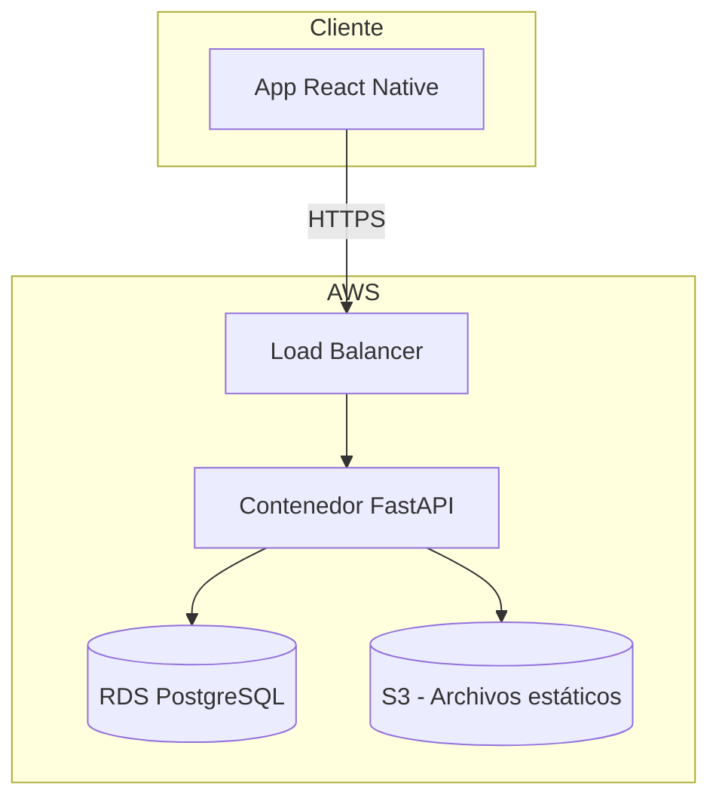
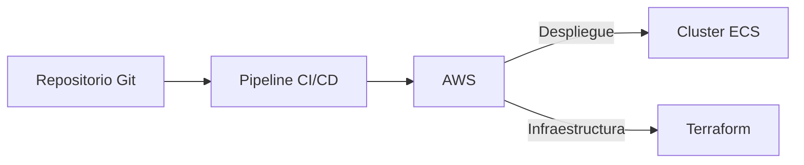

# Diagramas de Arquitectura

A continuación se muestran diagramas simplificados de la interacción entre la infraestructura, el backend y el frontend de **Friends Money**.

El diagrama anterior muestra la comunicación básica entre la aplicación del usuario (frontend) y los componentes desplegados en AWS.

Este segundo diagrama ilustra cómo el código del repositorio se integra con la canalización de CI/CD para generar los contenedores y aplicarlos en la nube usando Terraform.
